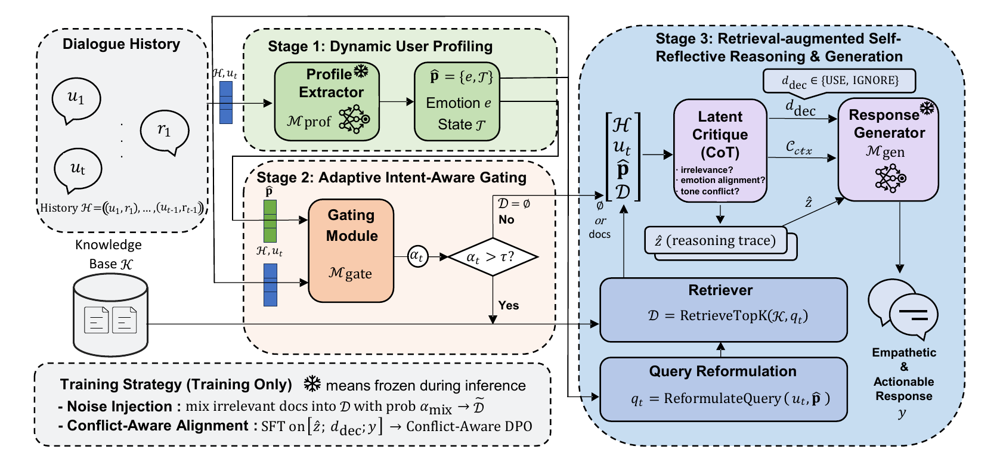

# CARE: When Not to Retrieve

Official repository for **“CARE: When Not to Retrieve—Conflict-Aware Empathetic Dialogue via Intent-Gated Retrieval and Latent Critique”**, accepted at **CIKM 2026**.

## Overview

CARE is a conflict-aware retrieval-augmented framework for empathetic dialogue. It learns when external knowledge should be retrieved, used, or withheld.

## Architecture

## Code

**Code coming soon.**
